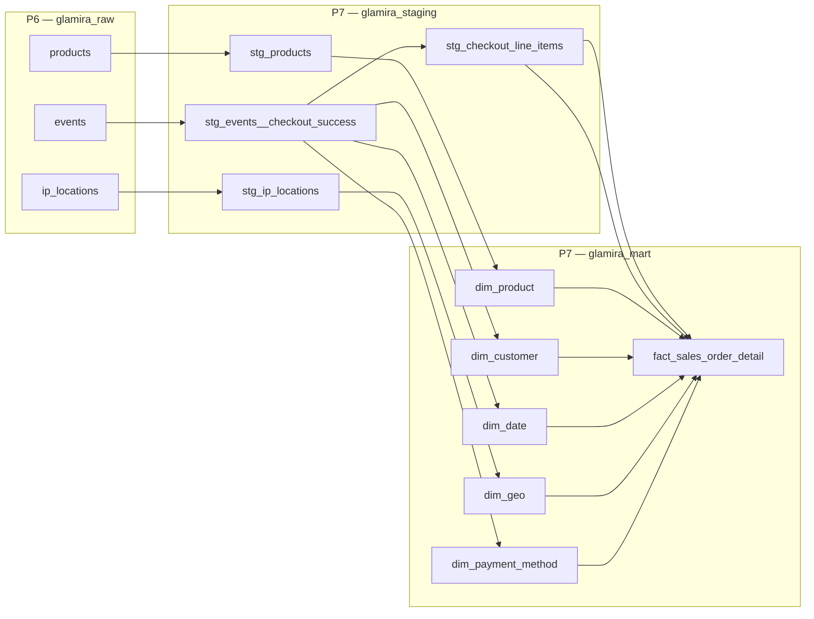
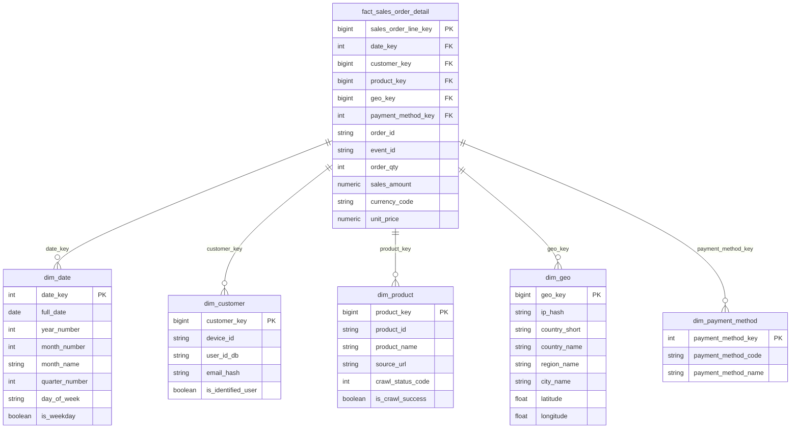

# Project 07 — Glamira Data Model (Dimensional / Star Schema)

**Project:** `unigap-de-glamira-data`  
**Source (P6):** `glamira_raw` — `events`, `products`, `ip_locations`  
**Target (P7):** `glamira_staging` → `glamira_mart`  
**Fact type:** **Transaction fact** — grain = **one checkout line item** (from `checkout_success`)

---

## 1. Architecture overview

---

## 2. Star schema (logical model)

---

## 3. Table dictionary

### 3.1 Fact — `mart.fact_sales_order_detail`

| Column | Type | Role | Description |
|--------|------|------|-------------|
| `sales_order_line_key` | BIGINT | PK | Surrogate key (one row per line item) |
| `date_key` | INT | FK → dim_date | Order / checkout date |
| `customer_key` | BIGINT | FK → dim_customer | Who |
| `product_key` | BIGINT | FK → dim_product | What |
| `geo_key` | BIGINT | FK → dim_geo | Where |
| `payment_method_key` | INT | FK → dim_payment_method | How (PayPal, etc.) |
| `order_id` | STRING | Degenerate dim | Business order id from event |
| `event_id` | STRING | Natural key | Mongo `_id` (`$.oid`) |
| `order_qty` | INT | Measure | Quantity (from line item or default 1) |
| `sales_amount` | NUMERIC(18,2) | Measure | Line revenue |
| `unit_price` | NUMERIC(18,2) | Measure | Optional: amount / qty |
| `currency_code` | STRING | Attribute | e.g. EUR, USD |

**Source filter:** `glamira_raw.events` WHERE `COALESCE(event_name, collection) = 'checkout_success'`.

**Grain:** One row per product line in a successful checkout (unnest `cart_products` JSON; fallback to top-level `product_id` if single-item checkout).

---

### 3.2 `mart.dim_date`

| Column | Type | Description |
|--------|------|-------------|
| `date_key` | INT | PK — `YYYYMMDD` (e.g. 20260519) |
| `full_date` | DATE | Calendar date |
| `year_number` | INT | e.g. 2026 |
| `quarter_number` | INT | 1–4 |
| `month_number` | INT | 1–12 |
| `month_name` | STRING | e.g. May |
| `week_of_year` | INT | ISO week |
| `day_of_month` | INT | 1–31 |
| `day_of_week` | STRING | Monday … Sunday |
| `day_of_week_number` | INT | 1=Mon … 7=Sun |
| `is_weekday` | BOOL | TRUE Mon–Fri |
| `is_weekend` | BOOL | TRUE Sat–Sun |

---

### 3.3 `mart.dim_customer`

| Column | Type | Description |
|--------|------|-------------|
| `customer_key` | BIGINT | PK — surrogate (`ROW_NUMBER`) |
| `device_id` | STRING | Natural key — Countly device |
| `user_id_db` | STRING | Logged-in user id (nullable) |
| `email_hash` | STRING | SHA256(email) — **PII masked** |
| `is_identified_user` | BOOL | TRUE when `user_id_db` or email present |
| `first_seen_date` | DATE | Min checkout date (optional) |
| `last_seen_date` | DATE | Max checkout date (optional) |

**Source:** distinct `device_id` / `user_id_db` from checkout events.

---

### 3.4 `mart.dim_product`

| Column | Type | Description |
|--------|------|-------------|
| `product_key` | BIGINT | PK — surrogate |
| `product_id` | STRING | Natural key — business id |
| `product_name` | STRING | From crawl (`products`) |
| `source_url` | STRING | Crawled URL |
| `crawl_status_code` | INT | HTTP status (200, 403, …) |
| `is_crawl_success` | BOOL | TRUE when status = 200 |
| `product_updated_at` | TIMESTAMP | Last crawl time |

**Source:** `glamira_raw.products` deduped by `product_id`.

---

### 3.5 `mart.dim_geo`

| Column | Type | Description |
|--------|------|-------------|
| `geo_key` | BIGINT | PK — surrogate |
| `ip_hash` | STRING | SHA256(ip) — **PII masked** |
| `country_short` | STRING | ISO-2 (VN, DE, …) |
| `country_name` | STRING | e.g. Viet Nam |
| `region_name` | STRING | Region / state |
| `city_name` | STRING | City |
| `latitude` | FLOAT64 | Valid range -90..90 |
| `longitude` | FLOAT64 | Valid range -180..180 |
| `timezone` | STRING | From ip_locations |
| `geo_source` | STRING | `ip2location` or `event_fallback` |

**Source:** `ip_locations` JOIN checkout `ip`; fallback event `country`/`city` if IP missing.

---

### 3.6 `mart.dim_payment_method`

| Column | Type | Description |
|--------|------|-------------|
| `payment_method_key` | INT | PK — surrogate |
| `payment_method_code` | STRING | e.g. `paypal`, `other`, `unknown` |
| `payment_method_name` | STRING | e.g. PayPal, Other |

**Source:** normalize raw `is_paypal` (STRING in P6 raw).

---

## 4. Staging layer — column detail (`glamira_staging`)

### 4.1 `staging.stg_events__checkout_success`

Filter: `COALESCE(event_name, collection) = 'checkout_success'`.

| Column | Type | From raw `events` |
|--------|------|-------------------|
| `event_id` | STRING | `JSON_VALUE(_id, '$.oid')` |
| `event_type` | STRING | `COALESCE(event_name, collection)` |
| `time_stamp` | INT64 | `time_stamp` |
| `event_ts` | TIMESTAMP | `TIMESTAMP_SECONDS(time_stamp)` |
| `event_date` | DATE | `DATE(TIMESTAMP_SECONDS(time_stamp))` |
| `device_id` | STRING | `device_id` |
| `user_id_db` | STRING | `user_id_db` |
| `email_address` | STRING | raw — **not exposed in mart** |
| `ip` | STRING | raw — join only |
| `order_id` | STRING | `order_id` |
| `product_id` | STRING | top-level `product_id` |
| `price_raw` | NUMERIC | `SAFE_CAST(price AS NUMERIC)` |
| `currency_code` | STRING | `currency` |
| `is_paypal_raw` | STRING | `is_paypal` |
| `country_event` | STRING | `country` (fallback geo) |
| `city_event` | STRING | `city` |
| `cart_products` | JSON | kept for unnest |
| `option` | JSON | optional attributes |
| `is_price_valid` | BOOL | price cast succeeded |

---

### 4.2 `staging.stg_checkout_line_items`

Grain: **one row per line item** (unnest `cart_products`).

| Column | Type | Description |
|--------|------|-------------|
| `line_item_id` | STRING | `event_id` + line sequence |
| `event_id` | STRING | FK to checkout event |
| `order_id` | STRING | Order id |
| `product_id` | STRING | Line product id |
| `order_qty` | INT64 | Qty from JSON or default 1 |
| `line_amount` | NUMERIC(18,2) | Line revenue |
| `unit_price` | NUMERIC(18,2) | line_amount / qty |
| `currency_code` | STRING | Currency |
| `line_number` | INT64 | Position in cart |

*If `cart_products` empty:* one row from event-level `product_id` + `price_raw`.

---

### 4.3 `staging.stg_products`

| Column | Type | From raw `products` |
|--------|------|---------------------|
| `product_id` | STRING | `product_id` |
| `product_name` | STRING | `product_name` |
| `source_url` | STRING | `source_url` |
| `crawl_status_code` | INT64 | `status` |
| `crawl_error` | STRING | `error` |
| `is_crawl_success` | BOOL | status = 200 |
| `updated_at` | TIMESTAMP | `updated_at` |

Dedupe: `QUALIFY ROW_NUMBER() OVER (PARTITION BY product_id ORDER BY updated_at DESC) = 1`.

---

### 4.4 `staging.stg_ip_locations`

| Column | Type | From raw `ip_locations` |
|--------|------|---------------------------|
| `ip` | STRING | `ip` |
| `country_short` | STRING | `country_short` |
| `country_name` | STRING | `country_long` |
| `region_name` | STRING | `region` |
| `city_name` | STRING | `city` |
| `latitude` | FLOAT64 | validated lat |
| `longitude` | FLOAT64 | validated lon |
| `timezone` | STRING | `timezone` |
| `updated_at` | TIMESTAMP | `updated_at` |

Dedupe: one row per `ip` (latest `updated_at`).

---

## 5. Staging layer summary

| Model | Purpose |
|-------|---------|
| `stg_events__checkout_success` | Filter + cast checkout events |
| `stg_checkout_line_items` | Unnest cart → line grain for fact |
| `stg_products` | Clean product reference |
| `stg_ip_locations` | Clean geo reference |

---

## 6. Looker dashboards → fact / dims

| Dashboard | Primary fact | Primary dimensions | Key metrics |
|-----------|--------------|-------------------|-------------|
| Revenue analysis | `fact_sales_order_detail` | `dim_date`, `dim_payment_method` | SUM(sales_amount), COUNT(DISTINCT order_id), AOV |
| Geographic distribution | `fact_sales_order_detail` | `dim_geo` | Revenue & orders by country / city |
| Time-based trends | `fact_sales_order_detail` | `dim_date` | Revenue, orders over day / week / month |
| Product performance | `fact_sales_order_detail` | `dim_product` | Revenue, units, top products |

---

## 7. PII handling (mart only)

| Field (raw) | Mart treatment |
|-------------|----------------|
| `email_address` | `email_hash` in dim_customer (SHA256) |
| `ip` | `ip_hash` in dim_geo; expose country/city only in Looker |

---

## 8. How to export diagram for review

1. **Mermaid (this file):** Open in VS Code / GitHub — export PNG from Mermaid preview, or paste at [mermaid.live](https://mermaid.live).
2. **dbdiagram.io:** Import `glamira_mart.dbml` in same folder → Export PNG/PDF.
3. **drawSQL:** Recreate from section 2–3 (star layout).

---

## 9. Notes for reviewer

- Same **star-schema pattern** as Adventure Works `fact_sales`, adapted to **event-driven** Glamira data (no `dim_sales_person`).
- **Transaction fact**, not periodic or accumulating snapshot.
- Raw layer (`glamira_raw`) unchanged from Project 6; all cleansing in **dbt staging**.
